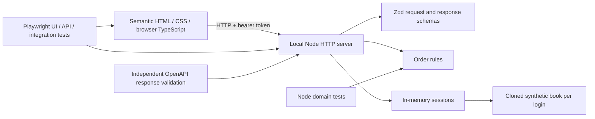
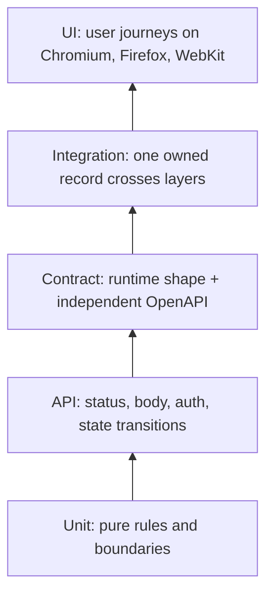

# TradeFlow Lab

A local, synthetic institutional-trading **interview and learning lab** built to demonstrate reliable test engineering. The product stays small: log in, inspect an order blotter, filter it, submit an order, view details, and cancel an eligible order. The engineering focus is typed fixtures, isolated state, API boundaries, independent contracts, browser coverage, and useful failure evidence.

All users, credentials, orders, positions, and instruments are synthetic. There are no brokerage connections, market feeds, external secrets, real trades, employer systems, or proprietary data. The symbols are familiar examples; their displayed values are invented.

## Run it

Use Node.js 24 LTS and npm on Windows, macOS, or Linux. Node's [release schedule](https://nodejs.org/en/about/previous-releases) identifies the supported LTS lines. From the repository root:

```sh
npm ci
npm run browsers:install
npm start
```

Open [TradeFlow Lab](http://127.0.0.1:3000). Sign in as `qa.user` with `Password123!`. The read-only user is `qa.viewer`, with the same public synthetic password. **Stop the server with Ctrl+C before running Playwright or `validate`.** Tests always start and own their server; `reuseExistingServer: false` requires port 3000 to be free. This prevents a stale manual process from being tested accidentally.

```sh
npm run validate
npm test -- --repeat-each=2
npm run report
```

Normal gates should exit `0`; the HTML report lists results by project. Actual commands, counts, and platform limitations from implementation verification are recorded in [validation evidence](docs/VALIDATION.md). This README is a guide to behavior, not a substitute for a test run.

## What to inspect

| Capability                                     | Evidence in the repository                                                |
| ---------------------------------------------- | ------------------------------------------------------------------------- |
| Strict TypeScript and runtime validation       | `tsconfig.json`, `app/domain/`, `tests/unit/`                             |
| Fixture lifetimes and auth state               | `tests/fixtures/tradeflow.fixture.ts`                                     |
| Small, readable Page Objects                   | `pages/`, `tests/ui/`                                                     |
| REST boundaries and negative paths             | `tests/api/`                                                              |
| Runtime schemas and independent OpenAPI checks | `contracts/openapi.yaml`, `tests/contract/`                               |
| State crossing API and UI                      | `tests/integration/order-state.spec.ts`                                   |
| Parallel isolation and three browser engines   | `playwright.config.ts`, per-test sessions                                 |
| Failure evidence                               | `tests/failure-demo/`, [triage guide](docs/TRACING_AND_FAILURE_TRIAGE.md) |
| Deterministic CI and finite artifact retention | `.github/workflows/quality.yml`                                           |
| Human review of AI proposals                   | `AGENTS.md`, [AI workflow](docs/AI_ASSISTED_TESTING.md)                   |

## Architecture



Each login creates a separate order book. Reusing a username does not share mutable orders. Test fixtures create a fresh token, place it in in-memory browser `storageState`, and revoke the session during teardown. A worker fixture shares only immutable health metadata. This makes increasing worker count safe because isolation comes from the data model, not from test ordering.



The layers have different responsibilities. Exhaustive validation belongs close to the domain and API; browser tests prove selected user journeys. The diagram expresses scope, not a promised ratio of test counts.

## Commands

| Command                       | Purpose / expected result                                                           |
| ----------------------------- | ----------------------------------------------------------------------------------- |
| `npm start`                   | Start the local app at `http://127.0.0.1:3000`                                      |
| `npm run typecheck`           | Strict compiler checks; no JavaScript emitted                                       |
| `npm run lint`                | Static code quality checks                                                          |
| `npm run format:check`        | Verify formatting                                                                   |
| `npm run contract:validate`   | Validate the OpenAPI document itself                                                |
| `npm run workflow:validate`   | Parse workflow YAML and check gates/artifact structure; does not run hosted Actions |
| `npm run test:unit`           | Domain checks without a browser                                                     |
| `npm test`                    | API/contract once; UI/integration on all three engines                              |
| `npm run test:ui`             | UI journeys across browser projects                                                 |
| `npm run test:api`            | HTTP semantics and authorization boundaries                                         |
| `npm run test:contract`       | Live responses and deliberately malformed fixtures                                  |
| `npm run test:integration`    | API/UI state consistency                                                            |
| `npm run validate`            | Typecheck, lint, format, OpenAPI, workflow, unit, then normal Playwright suite      |
| `npm test -- --repeat-each=2` | Repeat normal tests to look for intermittent failures                               |
| `npm run demo:failure`        | **Expected exit `1`**; wrong UI expectation produces evidence                       |
| `npm run demo:contract`       | **Expected exit `1`**; HTTP 200 with a malformed body fails validation              |
| `npm run report`              | Open the normal HTML report                                                         |
| `npm run report:demo`         | Open the most recent isolated intentional-failure report                            |
| `npm run perf:smoke`          | Optional local API latency/error smoke check                                        |

Failure demonstrations write to `demo-results/` and `demo-report/`, separate from normal `test-results/` and `playwright-report/`. Run one demo, inspect its report, then run the other. Intentional failures are excluded from normal tests and CI.

## Learn and present

Start with [the five-minute demo](docs/INTERVIEW_DEMO.md), [the two-day plan](docs/TWO_DAY_LEARNING_PLAN.md), and [interview questions](docs/INTERVIEW_QUESTIONS.md). The first five code files to study are `playwright.config.ts`, `tests/fixtures/tradeflow.fixture.ts`, `tests/ui/orders.spec.ts`, `tests/api/orders.spec.ts`, and `tests/contract/responses.spec.ts`.

Design details: [architecture](docs/ARCHITECTURE.md), [strategy](docs/TEST_STRATEGY.md), [fixtures](docs/FIXTURES.md), [parallelism](docs/PARALLELISM_AND_FLAKINESS.md), [API/contracts](docs/API_AND_CONTRACT_TESTING.md), [CI](docs/CI_CD.md), and [AI review](docs/AI_ASSISTED_TESTING.md).

## Deliberate limits

This is one local process with in-memory state. Restarting it deletes sessions and orders. Positions are a static synthetic read model; there is no matching engine, execution simulator, persistence, reconciliation, real identity provider, or production security claim. A local performance smoke is not capacity planning. Cross-browser results and repeated runs establish evidence for the checked scenarios; they cannot prove absence of defects.
