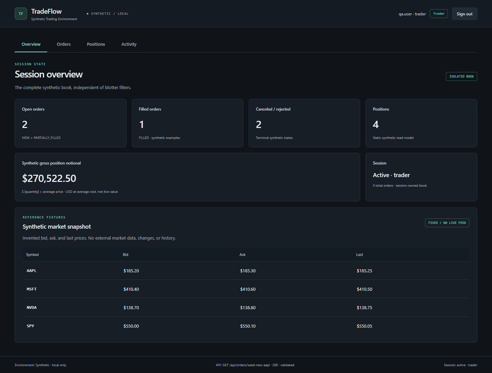
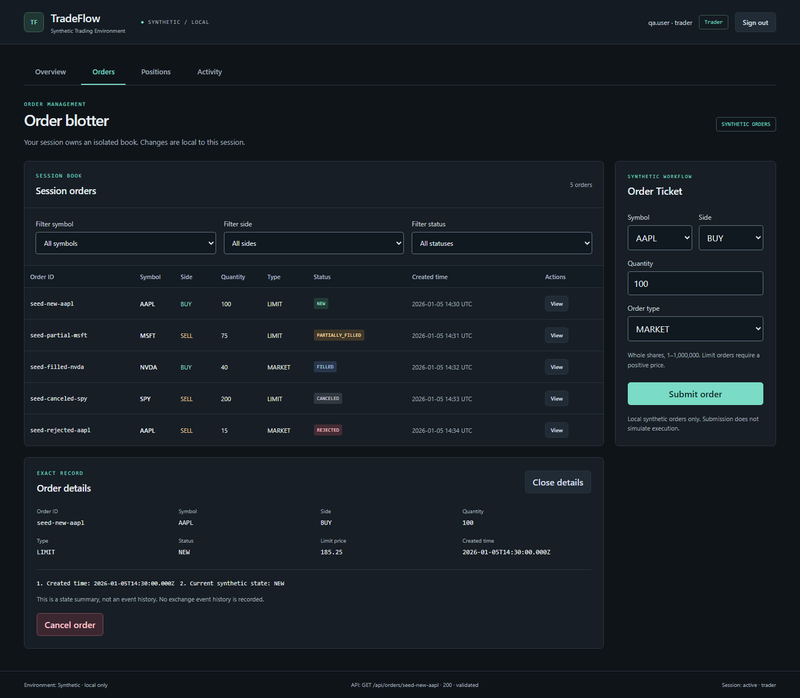
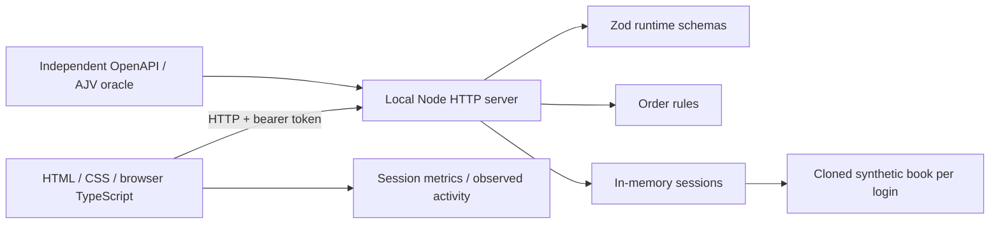
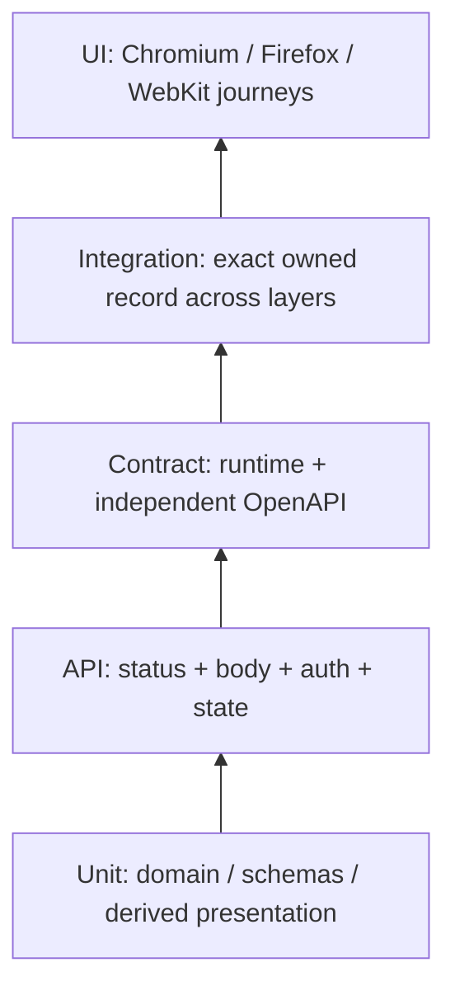

# TradeFlow

**Synthetic Institutional-Trading SDET Lab**

A small trading workstation built to make quality engineering inspectable: **Playwright, strict TypeScript, UI + API + contract + integration tests, test-scoped fixtures, parallel execution, Chromium / Firefox / WebKit, OpenAPI/runtime validation, failure tracing, GitHub Actions, and human-reviewed AI assistance.** This is an interview and learning project, not a production trading platform.

Every user, credential, order, position, and quote is synthetic. There are no brokerage connections, live feeds, real trades, employer systems, proprietary code, or customer data. Familiar instrument symbols do not make invented prices market data.

## Run locally

Use Node.js 24 and npm. From the repository root:

```sh
npm ci
npm run browsers:install
npm start
```

Open [TradeFlow](http://127.0.0.1:3000).

| Role   | Username    | Public synthetic password | Permissions                             |
| ------ | ----------- | ------------------------- | --------------------------------------- |
| Trader | `qa.user`   | `Password123!`            | Inspect, submit, cancel eligible orders |
| Viewer | `qa.viewer` | `Password123!`            | Read only; API mutations return 403     |

Each login creates an isolated order book. **Stop the manual server with Ctrl+C before tests.** Playwright starts its own server on port 3000 with `reuseExistingServer: false`; a stale manual process cannot supply results.

```sh
npm run validate
npm test -- --repeat-each=2
npm run report
```

## The workstation

Orders is the default view. Four lightweight, keyboard-accessible tabs keep the product small:

| View      | What it demonstrates                                                                                                                             |
| --------- | ------------------------------------------------------------------------------------------------------------------------------------------------ |
| Overview  | Full-session order counts, static position count, and explicitly synthetic gross position notional at average cost; filters do not change totals |
| Orders    | Server-side filters, MARKET/LIMIT ticket, exact-record details, and eligible cancellation; viewer controls remain visible and disabled           |
| Positions | Fixed symbol, quantity, and average-price read model; order submission does not imply a fill                                                     |
| Activity  | Actions observed by this browser in its current session, cleared on logout/reload; no durable or enterprise audit-log claim                      |

The four-symbol snapshot contains fixed synthetic bid/ask/last values. Details show the known creation timestamp and current API status, not invented exchange events or transition timestamps. The footer reports observed API responses and session state, not infrastructure health monitoring.

Actual local Chromium captures, with synthetic data:





Additional captures: [768px orders with a created UUID and sub-cent LIMIT price](docs/screenshots/tradeflow-orders-768.png), [1024px read-only viewer](docs/screenshots/tradeflow-viewer-1024.png), [positions](docs/screenshots/tradeflow-positions-1024.png), and [browser activity](docs/screenshots/tradeflow-activity-1024.png). These are observed renders, not generated mockups or visual-regression baselines.

## Architecture and ownership



The server owns authentication, authorization, validation, and order transitions. The browser displays server state and rejects malformed responses. Presentation caches belong to a token and request version: delayed responses cannot populate a replacement session or overwrite a newer accepted mutation. Unknown/loading data differs from a validated empty book.

The fixture authenticates through the API, supplies **in-memory `storageState`** to Playwright's built-in context/page, and revokes its session during teardown. Mutable state is test scoped; a worker fixture shares only immutable health metadata. Page Objects expose actions and locators; assertions remain visible in tests.



API/contract tests run once in the browser-free `service` project. UI/integration tests run on all three engines. Projects define coverage; four local workers or two CI workers define concurrency. The diagram expresses responsibilities, not a promised pyramid ratio.

## Evidence

Check [current branch Actions runs](https://github.com/farhan-shafee/institutional-trading-sdet-lab/actions/workflows/quality.yml?query=branch%3Acodex%2Fproductization-pass) for the exact latest SHA and its hosted report. The revision-specific results below retain their original provenance.

Fresh local productization runs passed **34 unit checks, 205 normal Playwright executions, and 410 repeated executions**, with zero failed, flaky, skipped, or retried normal tests. The arithmetic is `42 API + 22 contract + 3 × (44 UI + 3 integration) = 205`. See [productization evidence](docs/PRODUCTIZATION.md) for commands, actual captures, review findings, and limits.

Before the final portfolio review, the productization implementation passed [hosted Ubuntu CI, run 36967330696](https://github.com/farhan-shafee/institutional-trading-sdet-lab/actions/runs/36967330696) at `62587a444e51428481ef4293a45bf970a82a4886`: **34 unit checks and 205 Playwright executions**. The downloaded [HTML artifact](https://github.com/farhan-shafee/institutional-trading-sdet-lab/actions/runs/36967330696/artifacts/11210666114) independently confirms all three browsers and zero failed, flaky, skipped, or retried tests. This is the inspected source revision; this evidence record was added afterward.

The audited baseline passed [hosted Ubuntu CI, run 36959822791](https://github.com/farhan-shafee/institutional-trading-sdet-lab/actions/runs/36959822791) at `f7f2f108576fd5d940f4a9649519d24be9ecb778`: **31 unit checks and 184 Playwright executions**, with zero failed, flaky, skipped, or retried tests. This historical run does not validate later changes.

CI installs the lockfile and Linux browser dependencies, then gates TypeScript, lint, formatting, OpenAPI, workflow structure, units, and the normal suite. `failOnFlakyTests` rejects a test that passes only on retry. HTML reports retain for **14 days**; conditional failure evidence retains for **7 days**. A green run skips the failure upload and does not prove that path. Local failure demos independently produce actual traces, screenshots, videos, and JSON.

Historical evidence remains in [validation](docs/VALIDATION.md), the [hostile audit](docs/AUDIT.md), and the [delivery report](docs/DELIVERY_REPORT.md). Counts/results belong to their revision and run.

## Five-minute screen-share

1. Sign in as trader. Show the synthetic label, Overview, Orders, Positions, and Activity. Filter AAPL; explain why Overview uses the whole book. Submit a LIMIT order, inspect its exact ID, then cancel. Activity records observed actions; positions remain static.
2. Sign out and use `qa.viewer`. Show visible disabled controls and the API 403 regression. Stop the manual server.
3. Open `playwright.config.ts` and `tests/fixtures/tradeflow.fixture.ts`: explain projects versus workers, session cloning, fixture scope, teardown, and in-memory storage state.
4. Show an exact-ID integration test and passing malformed-HTTP-200 regression. Run a small API case and show a prepared intentional-failure trace:

   ```sh
   npm run test:api -- --grep "filled"
   npm run demo:failure
   npm run report:demo
   ```

   The demo deliberately exits **1**, with separate `demo-results/` and `demo-report/`; it never replaces the normal report.

5. Show the exact hosted run, finite artifacts, and [AI review workflow](docs/AI_ASSISTED_TESTING.md). AI proposes/analyzes; humans accept behavior changes and deterministic gates decide results.

Use prepared evidence if a live command exceeds the screen-share time; state when it ran. See the [detailed demo](docs/INTERVIEW_DEMO.md) and [study questions](docs/INTERVIEW_QUESTIONS.md).

## Commands and code to inspect

| Command                                                       | Purpose                                                      |
| ------------------------------------------------------------- | ------------------------------------------------------------ |
| `npm run typecheck` / `npm run lint` / `npm run format:check` | Static and formatting gates                                  |
| `npm run contract:validate` / `npm run workflow:validate`     | Specification/workflow-structure gates; not hosted execution |
| `npm run test:unit`                                           | Domain, schema, and presentation checks                      |
| `npm test`                                                    | Normal API/contract/UI/integration suite                     |
| `npm run validate`                                            | All static, specification, unit, and normal Playwright gates |
| `npm test -- --repeat-each=2`                                 | Repeated normal execution to expose intermittency            |
| `npm run demo:failure` / `npm run demo:contract`              | Deliberate failures; expected exit 1                         |
| `npm run report` / `npm run report:demo`                      | Normal / most recent demo HTML report                        |
| `npm run perf:smoke`                                          | Optional local API signal; excluded from deterministic CI    |

Start with [test strategy](docs/TEST_STRATEGY.md), [fixtures](docs/FIXTURES.md), [parallelism](docs/PARALLELISM_AND_FLAKINESS.md), [API/contracts](docs/API_AND_CONTRACT_TESTING.md), [failure triage](docs/TRACING_AND_FAILURE_TRIAGE.md), and [CI](docs/CI_CD.md). First code files to study: `playwright.config.ts`, `tests/fixtures/tradeflow.fixture.ts`, `tests/ui/productization.spec.ts`, `tests/api/orders.spec.ts`, and `tests/contract/responses.spec.ts`.

## Deliberate limits and publication

One loopback process holds in-memory state. Restarting it deletes sessions/orders. There is no matching engine, execution simulation, persistence, reconciliation, real identity provider, production security, P&L, or capacity claim. Lifecycle is a state projection; Activity is a browser observation list. Cross-browser/repeated results establish evidence for checked scenarios, not an absence-of-defects guarantee.

The repository remains private during this pass. Published credentials are fake fixtures. Reports, browser auth files, environment files, logs, and machine artifacts are ignored. `package.json` stays `private: true` to prevent accidental npm publication. **No project license has been selected:** dependency licenses do not grant rights to this repository. The owner must choose a license before presenting it as reusable open-source software.
