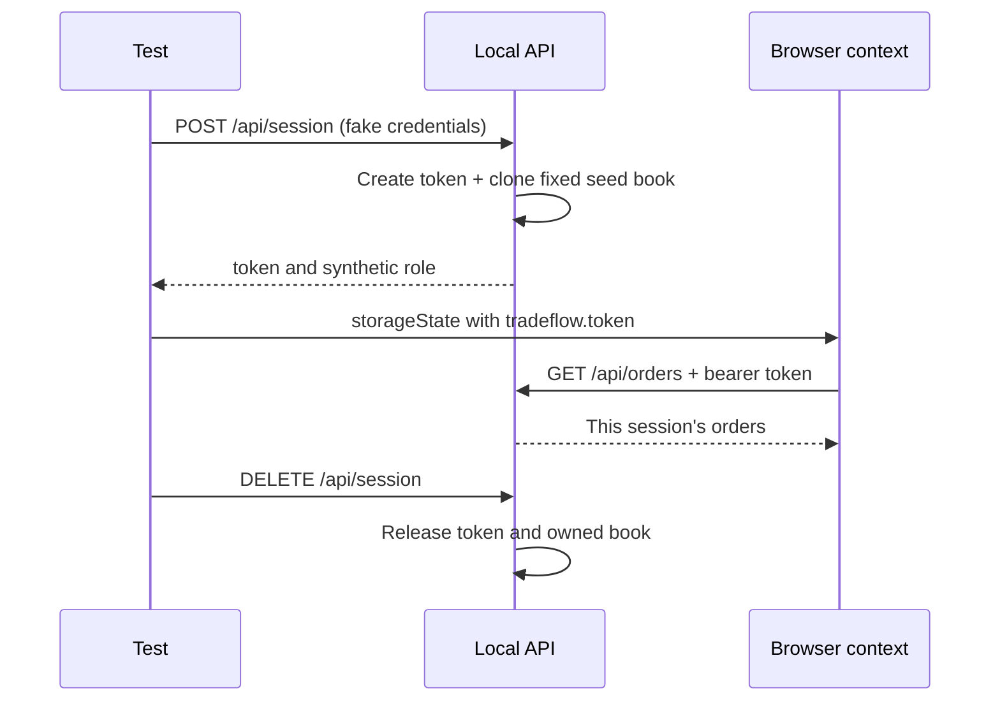

# Architecture

TradeFlow Lab has one process and one explicit purpose: make test engineering understandable. Node 24 runs a lightweight native HTTP server; `tsx` runs server TypeScript; esbuild bundles browser TypeScript. Semantic HTML/CSS avoids a framework lifecycle that contributes little to the demonstration.

## Boundaries

| Area                     | Responsibility                                                     | Reason                                                   |
| ------------------------ | ------------------------------------------------------------------ | -------------------------------------------------------- |
| `app/domain/`            | Types, runtime schemas, validation, seeded values, order rules     | Pure rules can be tested without HTTP or a browser       |
| `app/server/`            | Routing, authentication, authorization, response mapping, sessions | Status codes and resource ownership have one owner       |
| `app/public/`            | Login, blotter, filters, detail, entry and cancellation UI         | Thin client displays server truth                        |
| `contracts/openapi.yaml` | Published request/response/status vocabulary                       | Consumers need a wire contract independent of TypeScript |
| `tests/fixtures/`        | Lifecycle and ownership of test resources                          | Setup and cleanup compose without duplicated hooks       |
| `pages/`                 | Focused locators and user actions                                  | Tests retain their intent and assertions                 |
| `test-data/`             | Public reference constants and pure order factory                  | Generated inputs are explicit and reproducible           |
| `scripts/`               | Contract validation and optional performance smoke                 | Gates remain separate from app behavior                  |

## Session-owned state

Every login, including the same username, receives a new token and a separate cloned book. `qa.user` can submit and cancel; `qa.viewer` can read and receives `403` on mutations. Known seed IDs are reused safely because they belong to distinct books. Unknown IDs in another session return `404` rather than exposing that session's records.

Tests keep storage state in memory. The browser uses localStorage key `tradeflow.token`; request clients send the equivalent bearer token. One integration test shares its own session between those two interfaces, proving a cross-layer workflow without sharing it with another test.

## Observable rules

The supported symbols are AAPL, MSFT, NVDA, and SPY. Quantity is a positive integer at most 1,000,000. A LIMIT order requires a positive finite `limitPrice`; a MARKET order rejects a supplied price. Only NEW and PARTIALLY_FILLED orders can cancel. A successful cancellation changes status to CANCELED; an ineligible repeat receives `409`.

The seed book includes NEW, PARTIALLY_FILLED, FILLED, CANCELED, and REJECTED records with fixed timestamps. New records receive unique IDs and creation timestamps. Positions are a fixed synthetic view; order submission does not imply a fill or change position balances.

## Choices an interviewer should challenge

The in-memory model avoids migrations, containers, and real environment dependencies. It does not model distributed execution, failover, durable storage, risk checks, fills, exchange connectivity, or reconciliation. LocalStorage and public fake passwords demonstrate reusable auth setup and role checks; they are not a production identity design.

Zod provides executable runtime validation. OpenAPI supplies a second independently interpreted contract, so a TypeScript type shared by client and server cannot be the only oracle. Domain tests, service tests, and browser tests catch different failures. See [the layer strategy](TEST_STRATEGY.md) for what each gate proves.
