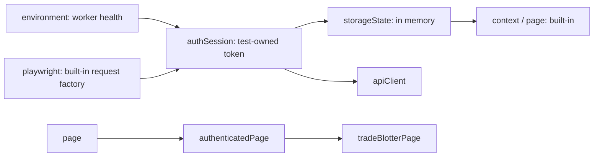

# Fixtures and authentication

Read `tests/fixtures/tradeflow.fixture.ts` beside `tests/integration/order-state.spec.ts`. A fixture is a typed dependency with a lifecycle. It can own resource setup and teardown in one place, and Playwright creates dependencies requested by a test. These are the central benefits of [Playwright fixtures](https://playwright.dev/docs/test-fixtures).

## Built-in fixtures remain visible

| Fixture   | Lifetime             | Role here                                               |
| --------- | -------------------- | ------------------------------------------------------- |
| `page`    | Test                 | Browser interactions, including explicit login tests    |
| `context` | Test                 | Isolated cookies/localStorage and browser resources     |
| `request` | Test                 | APIRequestContext for HTTP setup, requests, and cleanup |
| `browser` | Worker               | Browser engine shared to avoid launching per test       |
| `baseURL` | Configuration option | Origin used by relative requests and storage state      |

API tests can use `request` directly for missing-token or credential scenarios. Tests should not require an authenticated page merely to send an HTTP request.

Anonymous API cases import the built-in `test` from `@playwright/test`. The authenticated fixture module overrides `storageState`, and Playwright also consumes that option while preparing its built-in `request` contexts. Using the extended test for an anonymous case would therefore require a successful trader login before its test body runs. The in-memory localStorage token does not add a bearer header; it still creates an unwanted setup dependency.

## Custom fixtures

| Fixture             | Scope  | Responsibility                                                                                  |
| ------------------- | ------ | ----------------------------------------------------------------------------------------------- |
| `environment`       | Worker | Fetch and freeze immutable health metadata; dispose its probe context before yielding metadata  |
| `authSession`       | Test   | Authenticate, expose a token, revoke it with DELETE on teardown                                 |
| `storageState`      | Test   | Supply an in-memory origin/localStorage snapshot for that token                                 |
| `apiClient`         | Test   | Raw authenticated APIRequestContext in the same owned session; no wrapper API layer             |
| `authenticatedPage` | Test   | Expose a page authenticated by that storage state                                               |
| `orderFactory`      | Test   | Build valid input, POST an owned order, assert 201 and parsed values, return the created record |
| `tradeBlotterPage`  | Test   | Compose a small Page Object around the authenticated page                                       |

The exact fixture graph is executable in the source, including internal dependencies. Mutable authentication and order state stay test scoped. Health metadata can be worker scoped because it does not change between test actions. A worker fixture cannot depend on a test fixture: the shorter-lived value cannot safely serve a longer-lived resource.

## Setup, use, teardown

Code before `await use(value)` establishes the fixture. The awaited `use` call hands it to dependents and the test. Code after it releases owned resources when that lifetime finishes. A `try/finally` makes ownership explicit when cleanup must survive a downstream failure. Playwright disposes built-in contexts; the custom session fixture revokes server state it created.

Login produces a fresh clone of the seed book. The fixture creates a setup context through built-in `playwright.request.newContext`, and disposes it after DELETE cleanup. The separate authenticated `apiClient` context is disposed too. Anonymous tests use the built-in `test` and `request` without the authenticated fixture extension.

The fixture overrides built-in `storageState` with `{ cookies: [], origins: [...] }`, setting `tradeflow.token` for the configured origin. There is no committed `.auth` file and no shared worker login. API and browser see the same session only within the same test. The [authentication guide](https://playwright.dev/docs/auth) discusses choosing state lifetime according to whether tests modify server-side state.

`buildOrder` in `test-data/factories/order.factory.ts` is the pure input builder. The `orderFactory` fixture calls it and creates the server resource, checking HTTP 201 and returned values so failed setup cannot be mistaken for a successful test precondition.

## Why not duplicate beforeEach?

Hooks work for file-local sequencing. Repeated authentication hooks spread resource creation and cleanup across files and can silently give unrelated tests shared assumptions. Typed fixtures let each test request the smallest setup it needs and reuse a single lifecycle. A fixture earns its place by owning a resource or meaningful dependency; a pure formatter should remain a function.

`TradeBlotterPage` and `OrderEntryPage` represent actions and locators. Tests assert the business outcome. Avoid a generic base page that conceals all navigation, waiting, requests, and assertions: when a failure occurs, the reviewer should be able to connect the test line with a trace action immediately.
