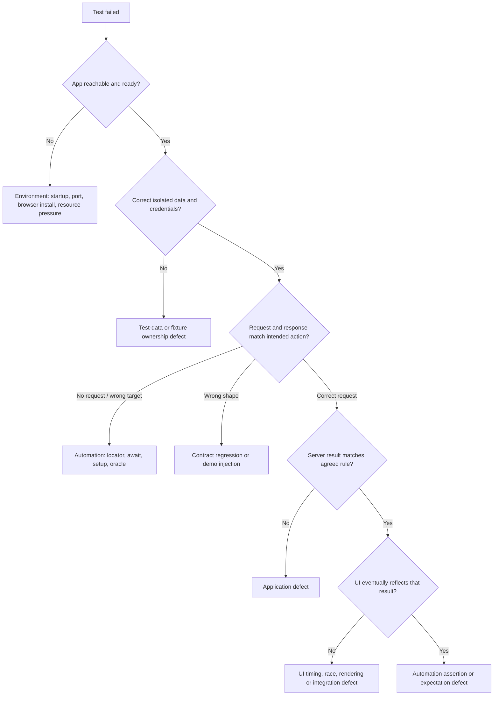

# Tracing and failure triage

A failure needs enough evidence to explain what the application and test actually did. The normal configuration uses `trace: 'on-first-retry'`, `screenshot: 'only-on-failure'`, and `video: 'retain-on-failure'`. Local retries are zero; therefore a first local failure does not automatically include a trace. CI's diagnostic retry does. Intentional demos use tracing from the start.

Capturing every successful browser run multiplies artifact volume across engines, workers, and repeats. The normal policy keeps routine storage smaller while retaining failure screenshots/videos. For a local reproduction, explicitly request a trace:

```sh
npm run test:ui -- --project=chromium --trace on
```

Do not turn trace retention or retries into a substitute for investigating an unreliable test.

## Reproducible evidence demonstration

```sh
npm run demo:failure
npm run report:demo
```

The first command intentionally exits `1`; that is the demonstration's expected process outcome. It asserts an incorrect UI status in `tests/failure-demo/ui-evidence.spec.ts`. The report identifies the failed assertion and links its trace, screenshot, and video. Demo output is in `demo-results/` and `demo-report/`; normal output is kept separate. Inspect this report before running another demo, which may replace demo artifacts.

Stop any manual `npm start` process with Ctrl+C before either demo. Playwright always owns its server on port 3000. In the UI example, `seed-new-aapl` actually has NEW status; the deliberately wrong expectation is FILLED.

For the contract variant:

```sh
npm run demo:contract
npm run report:demo
```

This intentionally fails after a browser route fulfills an orders request with HTTP 200 and malformed order data. The assertion/schema failure should point to the body, rather than a connectivity error. Normal contract tests independently prove that malformed data is rejected, and remain green.

## Read the trace in an order that answers a question

1. Start at the failed assertion and its call site. State the expected condition and actual value.
2. Select the preceding action. Inspect its locator, timing, and before/after DOM snapshots. Was the intended row and control targeted?
3. Inspect the request method, URL, status, and response body. Was a cancellation actually requested? Did the owned ID match the displayed ID?
4. Inspect console messages and earlier errors. A missing row can be a consequence of a failed fetch or rejected parsing, not the original defect.
5. Compare timing and screenshots with the action log. Did the test observe a real state transition or an assumed delay?

The [Trace Viewer guide](https://playwright.dev/docs/trace-viewer-intro) describes action, snapshot, network, and source inspection. Use the report's trace link or `npx playwright show-trace` followed by the actual `trace.zip` path from the result directory. Paths are generated per test; do not hard-code a guessed folder name into scripts.

On PowerShell, list actual traces with:

```powershell
Get-ChildItem demo-results -Recurse -Filter trace.zip
```

On macOS/Linux:

```sh
find demo-results -name trace.zip
```

## Triage decision tree



An external dependency issue is a useful category in a real system; this lab has no external runtime financial dependencies. Failure to download a browser during setup is an installation/environment issue. Do not invent a vendor outage to explain a local application failure.

## Evidence and next action

| Category    | Evidence to capture                       | Useful next action                               |
| ----------- | ----------------------------------------- | ------------------------------------------------ |
| Application | Valid input, wrong response/state, rule   | Reproduce through API and add focused regression |
| Automation  | Wrong locator/oracle, unawaited operation | Fix the test while preserving the rule           |
| Environment | Health/startup log, port, version         | Restore prerequisites; rerun unchanged test      |
| Test data   | Token ownership, seed assumptions, IDs    | Fix fixture lifetime and cleanup                 |
| Timing/race | Action/request ordering, eventual state   | Await the meaningful condition; fix actual race  |
| Contract    | HTTP status plus schema issue/body        | Align producer and agreed contract after review  |

A triage note should include test/project, commit, command, retry count, expected/actual behavior, redacted or synthetic evidence, candidate cause, and next experiment. Preserve the first failure. Never weaken the expectation solely because a rerun passed.
